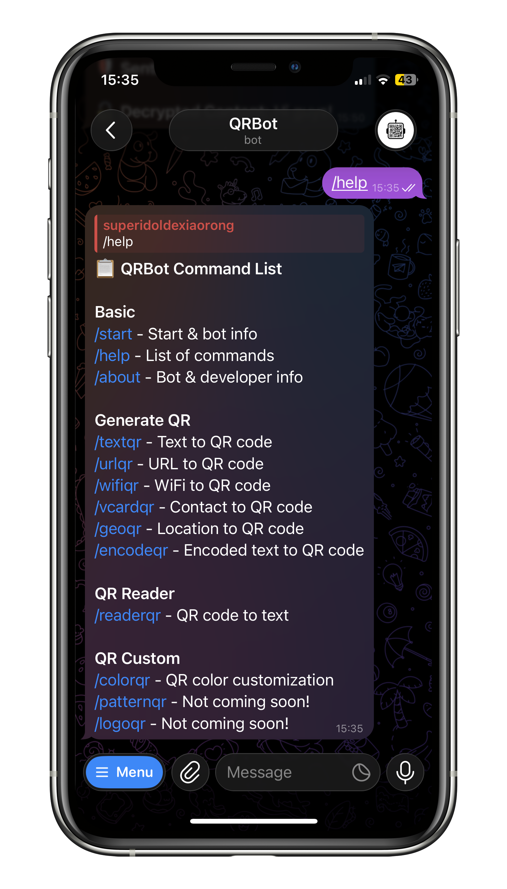

# QRBot 🤖


A powerful and versatile Telegram bot for generating and reading QR codes. Built with Python and Aiogram, it supports various QR types, custom styling, and secure encrypted QR codes.



🔗 **Try it out on Telegram:** [**@PautQRBot**](https://t.me/PautQRBot)  
📺 **How to use QRBot:** [**Watch on YouTube**](https://www.youtube.com/watch?v=uJM2nCFWCx4)

> [!NOTE]
> **Privacy First**: This bot processes data in-memory and does not store your generated QR codes or scanned images on the server.

## ✨ Features

- 🚀 **Generate QR Codes**:
    - **Text**: Convert simple text messages.
    - **URL**: Create links to websites.
    - **WiFi**: Easy WiFi sharing with SSID/Password/Encryption.
    - **vCard**: Share contact details professionally.
    - **Geo**: Share location coordinates (Google Maps, Waze, etc.).
    - **Encoded**: Base64, Hex, and ROT13 encoding.
- 🔒 **Sentinel QR**: Password-protected encrypted QR codes for secure data sharing.
- 👁️ **QR Reader**: Scan and decode QR codes from images sent to the bot.
- 🎨 **Customization**:
    - Choose custom foreground and background colors.
    - Light and Dark mode presets.
- 🛠 **Admin Tools**: Broadcast messages, user stats, ban management, and system monitoring.

## 📂 Project Structure

```
QRBot/
├── admin.py            # Admin tools and management
├── bot.py              # Main bot logic and handlers
├── database.py         # Database operations
├── middlewares.py      # Aiogram middlewares
├── notifications.py    # Notification system
├── qr_generator.py     # QR code generation logic
├── qr_reader.py        # QR code scanning logic
├── states.py           # FSM states
├── strings.py          # Bot text and string constants
├── render.yaml         # Render deployment configuration
├── requirements.txt    # Python dependencies
├── Dockerfile          # Docker setup
├── README.md           # Project documentation
├── INSTALLATION.md     # Detailed installation guide
└── CONTRIBUTING.md     # Contribution guidelines
```

## 🚀 Deployment

### Prerequisites

- Python 3.9+
- A Telegram Bot Token (from [@BotFather](https://t.me/BotFather))

### Installation

For detailed installation instructions on Windows, Linux, macOS, and Docker, please refer to the **[Installation Guide](INSTALLATION.md)**.

### Quick Start (Local)

1. **Clone the repository**
   ```bash
   git clone https://github.com/zis3c/QRBot.git
   cd QRBot
   ```

2. **Install dependencies**
   ```bash
   pip install -r requirements.txt
   ```

3. **Configure & Run**
   Set `TELEGRAM_BOT_TOKEN` in your environment and run:
   ```bash
   python bot.py
   ```

### ☁️ Deploy to Render

This project includes a `render.yaml` for easy deployment on Render.

1. Link your repository to Render.
2. Add the environment variables (`TELEGRAM_BOT_TOKEN`, `ADMIN_IDS`) in the Render dashboard.
3. Deploy! The bot includes a keep-alive web server to stay active.

## 🛠 Commands

| Command | Description |
| :--- | :--- |
| `/start` | Start the bot & view info |
| `/help` | View full command list |
| `/textqr` | Convert text to QR |
| `/urlqr` | Convert URL to QR |
| `/wifiqr` | Create WiFi login QR |
| `/vcardqr` | Create Contact (vCard) QR |
| `/geoqr` | Create Location QR |
| `/encodeqr` | Create Encoded QR (Base64/Hex/Sentinel) |
| `/readerqr` | Start QR Reader mode |
| `/colorqr` | Customize QR colors |

### Admin Commands
*(Only visible to admins)*
- `/admin` - Admin help
- `/stats` - View system statistics
- `/broadcast` - Send message to all users
- `/ban <user_id>` - Ban a user
- `/unban <user_id>` - Unban a user
- `/logs` - Get log files

## 🤝 Contributing

Contributions are welcome! Please see [CONTRIBUTING.md](CONTRIBUTING.md) for details.

## 📄 License

This project is licensed under the MIT License - see the [LICENSE](LICENSE) file for details.
